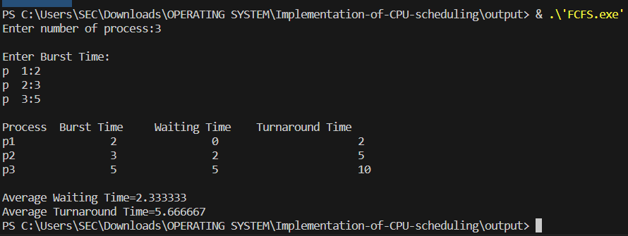
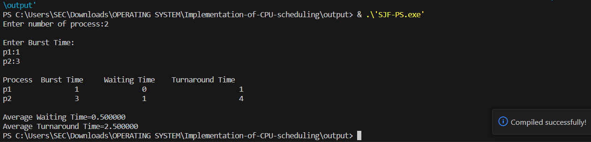
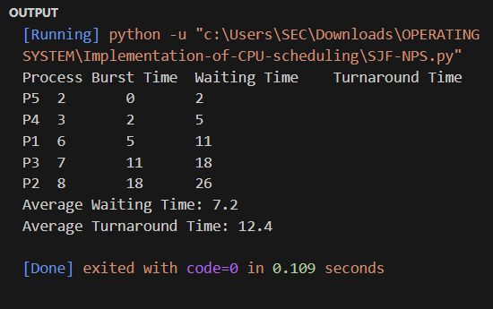
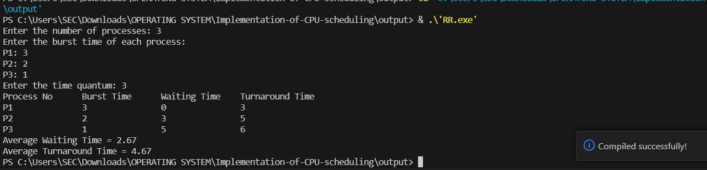
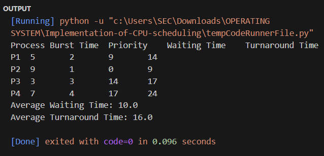
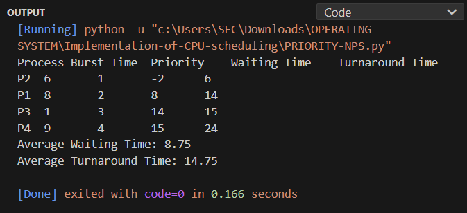

# EX.5-IMPLEMENTATION-OF-CPU-SCHEDULING-ALGORITHMS
# First-Come-First-Serve (FCFS) Scheduling
## AIM: 
To implement First-Come-First-Serve (FCFS) Scheduling

## ALGORITHM:
1. Start with a queue (or a list) to represent the ready queue of processes.
2. Initialize a timer or clock to 0.
3. Read the number of processes (n) and create a data structure to store process information, including arrival time (AT) and burst time (BT) for each process.
4. Read the arrival time and burst time for each process and store them in the data structure.
5. End

## PROGRAM:
```c
#include <stdio.h>
int main()
{
int bt[20],p[20],wt[20],tat[20],i,j,n,total=0,pos,temp; float
avg_wt,avg_tat;
printf("Enter number of process:");
scanf("%d",&n);
printf("\nEnter Burst Time:\n");
for(i=0;i<n;i++)
{
printf("p % d:",i+1);
scanf("%d",&bt[i]);
p[i]=i+1; //contains process number
}
wt[0]=0; //waiting time for first process will be zero and calculate waiting time
for(i=1;i<n;i++)
{
wt[i]=0;
for(j=0;j<i;j++)
wt[i]+=bt[j];
total+=wt[i];
}
avg_wt=(float)total/n; //average waiting time
total=0;
printf("\nProcess\t Burst Time \tWaiting Time\tTurnaround Time");
for(i=0;i<n;i++)
{
tat[i]=bt[i]+wt[i]; //calculate turnaround time
total+=tat[i];
printf("\np%d\t\t %d\t\t %d\t\t\t%d",p[i],bt[i],wt[i],tat[i]);
}
avg_tat=(float)total/n; //average turnaround time
printf("\n\nAverage Waiting Time=%f",avg_wt);
printf("\nAverage Turnaround Time=%f\n",avg_tat);
}
```

## OUTPUT:


## RESULT: 
First-Come-First-Serve Scheduling is implemented successfully.

# Shortest Job First (SJF) Preemptive Scheduling
## AIM: 
To implement Shortest Job First (SJF) Preemptive Scheduling

## ALGORITHM:
1. Initialize variables and arrays to store process information, such as process ID (p), arrival time (at), burst time (bt), start time (st), finish time (ft), waiting time (wt), turnaround time (tt), response ratio (rr), and a flag to mark completed processes (iscompleted).
2. Read the number of processes (n) from the user.

3. Read the process ID, arrival time, and burst time for each process and store them in respective arrays (p, at, bt).

4. Initialize variables, such as nextst (next start time) and counters.

5. Loop until all processes are completed:
  a. Find the process with the minimum burst time among the processes that have arrived and are not completed.
  b. Update the start time, finish time, waiting time, and turnaround time for the selected process.
  c. Calculate the response ratio (rr) for the selected process (rr = turnaround time / burst time).
  d. Mark the selected process as completed.
  e. Update the nextst to the finish time of the selected process.

6. Calculate the average waiting time (AWT) and average turnaround time (ATT) by summing up the individual waiting times and turnaround times and dividing by the total number of processes.

7. Display the process information, including process ID, arrival time, burst time, start time, finish time, waiting time, turnaround time, and response ratio.

8. Display the average waiting time and average turnaround time.

## PROGRAM:
```c
#include<stdio.h>
int main()
{
int bt[20],p[20],wt[20],tat[20],i,j,n,total=0,pos,temp; float
avg_wt,avg_tat;
printf("Enter number of process:");
scanf("%d",&n);
printf("\nEnter Burst Time:\n");
for(i=0;i<n;i++)
{
printf("p%d:",i+1);
scanf("%d",&bt[i]);
p[i]=i+1; //contains process number
}
//sorting burst time in ascending order using selection sort
for(i=0;i<n;i++)
{
pos=i;
for(j=i+1;j<n;j++)
{
if(bt[j]<bt[pos])
pos=j;
}
temp=bt[i];
bt[i]=bt[pos];
bt[pos]=temp;
temp=p[i];
p[i]=p[pos];
p[pos]=temp;
}
wt[0]=0; //waiting time for first process will be zero
//calculate waiting time
for(i=1;i<n;i++)
{
wt[i]=0;
for(j=0;j<i;j++)
wt[i]+=bt[j];
total+=wt[i];
}
avg_wt=(float)total/n; //average waiting time
total=0;
printf("\nProcess\t Burst Time \tWaiting Time\tTurnaround Time");
for(i=0;i<n;i++)
{
tat[i]=bt[i]+wt[i]; //calculate turnaround time
total+=tat[i];
printf("\np%d\t\t %d\t\t %d\t\t\t%d",p[i],bt[i],wt[i],tat[i]);
}
avg_tat=(float)total/n; //average turnaround time
printf("\n\nAverage Waiting Time=%f",avg_wt);
printf("\nAverage Turnaround Time=%f\n",avg_tat);
}
```


## OUTPUT:


## RESULT:
Shortest Job First (SJF) preemptive scheduling is implemented successfully.

# Shortest Job First (SJF) Non-Preemptive Scheduling

## AIM: 
To implement Shortest Job First (SJF) Non-Preemptive Scheduling

## ALGORITHM:
1. Initialize variables and arrays to store process information, such as process ID (process_id), arrival time (arrival_time), burst time (burst_time), completion time (completion_time), waiting time (waiting_time), and turnaround time (turnaround_time).

2. Read the number of processes (n) from the user.

3. Input process information for each process, including arrival time and burst time, and store this information in the respective arrays.

4. Sort the processes based on their arrival times in ascending order using a simple bubble sort algorithm. This step ensures that processes are in the order of their arrival.

5. Initialize the current time (time) to 0.

6. Perform the scheduling loop for all processes:
     a. Find the process with the smallest burst time that has already arrived and is not yet completed. Initialize "shortest_job" to -1 and "shortest_time" to a large initial value.
     b. Iterate through the processes, checking if they have arrived and if their burst time is smaller than the current "shortest_time." If so, update "shortest_job" to the current process.
     c. If "shortest_job" remains -1, it means no process is available to run at this time. Increment the time by 1.

     d. If a process is available (shortest_job != -1), execute the selected process. Update the completion time, waiting time, and turnaround time for this process. Mark the burst time of the completed process as -1 to indicate completion.

7. Display the scheduling information in a tabular format, including Process ID (P), Arrival Time (AT), Burst Time (BT), Completion Time (CT), Waiting Time (WT), and Turnaround Time (TAT) for each process.


## PROGRAM:
```py
def sjf_non_preemptive(processes, burst_time):
    n = len(processes)

    # Sort processes based on their burst times
    for i in range(n):
        for j in range(0, n - i - 1):
            if burst_time[j] > burst_time[j + 1]:
                processes[j], processes[j + 1] = processes[j + 1], processes[j]
                burst_time[j], burst_time[j + 1] = burst_time[j + 1], burst_time[j]

    # Calculate waiting time for each process
    waiting_time = [0] * n
    waiting_time[0] = 0

    for i in range(1, n):
        waiting_time[i] = burst_time[i - 1] + waiting_time[i - 1]

    # Calculate turnaround time for each process
    turnaround_time = [0] * n
    for i in range(n):
        turnaround_time[i] = waiting_time[i] + burst_time[i]

    # Calculate the average waiting time and average turnaround time
    total_waiting_time = sum(waiting_time)
    total_turnaround_time = sum(turnaround_time)
    average_waiting_time = total_waiting_time / n
    average_turnaround_time = total_turnaround_time / n

    # Print the results
    print("Process\tBurst Time\tWaiting Time\tTurnaround Time")
    for i in range(n):
        print(f"{processes[i]}\t{burst_time[i]}\t\t{waiting_time[i]}\t\t{turnaround_time[i]}")

    print(f"Average Waiting Time: {average_waiting_time}")
    print(f"Average Turnaround Time: {average_turnaround_time}")


# Example usage:
if __name__ == "__main__":
    processes = ['P1', 'P2', 'P3', 'P4', 'P5']
    burst_time = [6, 8, 7, 3, 2]
    sjf_non_preemptive(processes, burst_time)

```
## OUTPUT:


## RESULT:
Shortest Job First (SJF) Non-preemptive scheduling is implemented successfully.
# Round Robin (RR) Scheduling

## AIM: 
To implement Round Robin (RR) Scheduling

## ALGORITHM:
1. Initialize variables and arrays to store process information, scheduling data, and status flags.

2. Read the number of processes (n) and the time quantum (tq) from the user.

3. Input process information for each process, including process ID (PRO), arrival time (AT), and burst time (BUT). Also, calculate the total remaining burst time (totalsrt) and create a temporary array (tempsrt) to store the initial burst times.

4. Initialize the queue (queue), front (f), rear (r), and count variables for the ready queue. Also, initialize the timer to 0.

5. Enqueue processes that arrive at time 0 into the ready queue and mark them as entered (isentered) with count increments.

6. Enter the main scheduling loop, which continues until the timer reaches the total remaining burst time (totalsrt).

7. Dequeue a process from the front of the ready queue (queue[f]) and select it for execution.

8. If the selected process is starting for the first time (isstarted is 0), record its start time (ST) and calculate its waiting time (WT).

9. Execute the process for a time quantum (tq) or until its burst time (BUT) is less than tq, whichever comes first. Update the timer accordingly.
10. If the process has completed its burst time (BUT becomes 0), record its finish time (FT), calculate its waiting time (WT), turnaround time (TT), and response ratio (RR), and mark it as completed (iscompleted).

11. Check for processes that have arrived and have not entered the ready queue (isentered is 0). Enqueue them into the ready queue with count increments.

12. If the selected process is not completed, enqueue it back into the ready queue.

13. Repeat the scheduling loop until the timer reaches totalsrt.

14. Display the scheduling results, including process ID (PRO), arrival time (AT), initial burst time (BUT), start time (ST), finish time (FT), waiting time (WT), turnaround time (TT), and response ratio (RR) for each process.

15. Calculate and display the average waiting time (AWT) and average turnaround time (ATAT) for all processes.

## PROGRAM:
```c
#include<stdio.h>

int main() {
    int st[10], bt[10], wt[10], tat[10], n, tq;
    int i, count = 0, swt = 0, stat = 0, temp, sq = 0;
    float awt, atat;

    printf("Enter the number of processes: ");
    scanf("%d", &n);
    printf("Enter the burst time of each process:\n");
    for(i = 0; i < n; i++) {
        printf("P%d: ", i + 1);
        scanf("%d", &bt[i]);
        st[i] = bt[i];
    }

    printf("Enter the time quantum: ");
    scanf("%d", &tq);
    while(1) {
        for(i = 0, count = 0; i < n; i++) {
            temp = tq;
            if(st[i] == 0) {
                count++;
                continue;
            }
            if(st[i] > tq) {
                st[i] = st[i] - tq;
            } else if(st[i] >= 0) {
                temp = st[i];
                st[i] = 0;
            }
            sq = sq + temp;
            tat[i] = sq;
        }
        if(n == count) {
            break;
        }
    }

    for(i = 0; i < n; i++) {
        wt[i] = tat[i] - bt[i];
        swt = swt + wt[i];
        stat = stat + tat[i];
    }

    awt = (float)swt / n;
    atat = (float)stat / n;

    printf("Process No\tBurst Time\tWaiting Time\tTurnaround Time\n");
    for(i = 0; i < n; i++) {
        printf("P%d\t\t%d\t\t%d\t\t%d\n", i + 1, bt[i], wt[i], tat[i]);
    }
    printf("Average Waiting Time = %.2f\n", awt);
    printf("Average Turnaround Time = %.2f\n", atat);

    return 0;
}

```

## OUTPUT:


## RESULT:
Round Robin (RR) Scheduling is implemented successfully.

# Priority Preemptive Scheduling
## AIM: 
To implement Priority Preemptive Scheduling

## ALGORITHM:
1. Initialize the necessary variables and data structures, including the struct Process to represent each process.

2. Read the number of processes (n) from the user.

3. Create an array of struct Process to store information for each process.

4. Input process information for each process, including arrival time, burst time, and priority. Store this information in the struct Process array.

5. Initialize the current time (time) to 0 and the completed process count (completed) to 0.

6. Display the Gantt Chart header.

7. Enter the main scheduling loop that continues until all processes have completed execution (completed equals n).

8. Inside the loop, find the highest priority process that has arrived (arrival_time <= time) and has remaining burst time (remaining_time > 0).

9. If a process with the highest priority is found, execute it for 1 unit of time by decrementing its remaining_time and updating the Gantt Chart.

10. If the process has completed its execution (remaining_time becomes 0), increment the completed process count.

11. If no process is available to run at the current time, display a message indicating that no process is running at that time.

12. Repeat the loop until all processes are completed.

13. Display the scheduling results, including the Gantt Chart, process ID, and execution time for each process.


## PROGRAM:
```py
def priority_preemptive(processes, burst_time, priorities):
    n = len(processes)
    remaining_time = list(burst_time)  # Initialize remaining time for each process
    completion_time = [0] * n
    current_time = 0

    while True:
        highest_priority = None
        for i in range(n):
            if remaining_time[i] > 0:
                if highest_priority is None or priorities[i] < priorities[highest_priority]:
                    highest_priority = i

        if highest_priority is None:
            break

        remaining_time[highest_priority] -= 1
        current_time += 1

        if remaining_time[highest_priority] == 0:
            completion_time[highest_priority] = current_time

    waiting_time = [0] * n
    turnaround_time = [0] * n

    for i in range(n):
        turnaround_time[i] = completion_time[i]
        waiting_time[i] = turnaround_time[i] - burst_time[i]

    average_waiting_time = sum(waiting_time) / n
    average_turnaround_time = sum(turnaround_time) / n

    print("Process\tBurst Time\tPriority\tWaiting Time\tTurnaround Time")
    for i in range(n):
        print(f"{processes[i]}\t{burst_time[i]}\t\t{priorities[i]}\t\t{waiting_time[i]}\t\t{turnaround_time[i]}")

    print(f"Average Waiting Time: {average_waiting_time}")
    print(f"Average Turnaround Time: {average_turnaround_time}")

# Example usage:
if __name__ == "__main__":
    processes = ['P1', 'P2', 'P3', 'P4']
    burst_time = [5, 9, 3, 7]
    priorities = [2, 1, 3, 4]
    priority_preemptive(processes, burst_time, priorities)


```
## OUTPUT:


## RESULT: 
Priority Preemptive scheduling is implemented successfully.

# Priority Non-Preemptive Scheduling
## AIM:
To implement Priority Non-Preemptive Scheduling

## ALGORITHM:
1. Initialize variables and arrays to store process information, scheduling data, and status flags.

2. Input the number of processes and their details, including process ID (PID), arrival time (AT), burst time (SRT), and priority.

3. Calculate the total remaining burst time (totalsrt) by summing up the burst times of all processes and create a temporary array (tempsrt) to store the initial burst times.

4. Initialize the timer to 0.

5. Enter the main scheduling loop, which continues until all processes have completed execution (i.e., completed variable reaches n).

6. Within the loop, find the process with the highest priority that has arrived and not yet completed and has the lowest priority (higher priority value).

7. If a process is found, update its start time (ST) and calculate waiting time (WT) if it's starting for the first time (isstarted[i] is 0).

8. Reduce the remaining burst time (SRT) of the selected process by 1, indicating the execution of one time unit.

9. Increment the timer by 1.

10. If the selected process has completed its execution (SRT becomes 0), update its finish time (FT), waiting time (WT), turnaround time (TT), response ratio (RR), and set the process as completed (iscompleted[i] is 1).

11. Continue this loop until all processes are completed.

12. After scheduling all processes, display the scheduling results in a tabular format, including PID, AT, SRT, ST, FT, WT, TT, RR, and priority for each process.

13. Calculate and display the average waiting time (AWT) and average turnaround time (ATAT) for all processes.

## PROGRAM:
```py
def priority_non_preemptive(processes, burst_time, priorities):
    n = len(processes)
    completion_time = [0] * n
    waiting_time = [0] * n
    turnaround_time = [0] * n
    total_waiting_time = 0
    total_turnaround_time = 0

    # Create a list of tuples containing process information
    process_info = [(processes[i], burst_time[i], priorities[i]) for i in range(n)]

    # Sort the processes based on their priorities (lower values indicate higher priority)
    process_info.sort(key=lambda x: x[2])

    # Calculate completion times, waiting times, and turnaround times
    completion_time[0] = process_info[0][1]
    for i in range(1, n):
        completion_time[i] = completion_time[i - 1] + process_info[i][1]
    
    for i in range(n):
        turnaround_time[i] = completion_time[i]
        waiting_time[i] = turnaround_time[i] - burst_time[i]
        total_waiting_time += waiting_time[i]
        total_turnaround_time += turnaround_time[i]

    # Calculate the average waiting time and average turnaround time
    average_waiting_time = total_waiting_time / n
    average_turnaround_time = total_turnaround_time / n

    # Print the results
    print("Process\tBurst Time\tPriority\tWaiting Time\tTurnaround Time")
    for i in range(n):
        print(f"{process_info[i][0]}\t{process_info[i][1]}\t\t{process_info[i][2]}\t\t{waiting_time[i]}\t\t{turnaround_time[i]}")

    print(f"Average Waiting Time: {average_waiting_time}")
    print(f"Average Turnaround Time: {average_turnaround_time}")

# Example usage:
if __name__ == "__main__":
    processes = ['P1', 'P2', 'P3', 'P4']
    burst_time = [8, 6, 1, 9]
    priorities = [2, 1, 3, 4]
    priority_non_preemptive(processes, burst_time, priorities)
```

## OUTPUT:


## RESULT: 
Priority Non-preemptive scheduling is implemented successfully.

